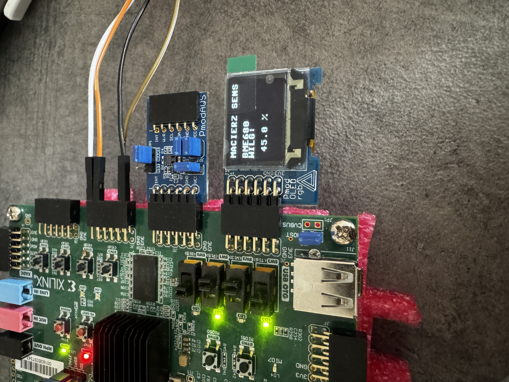
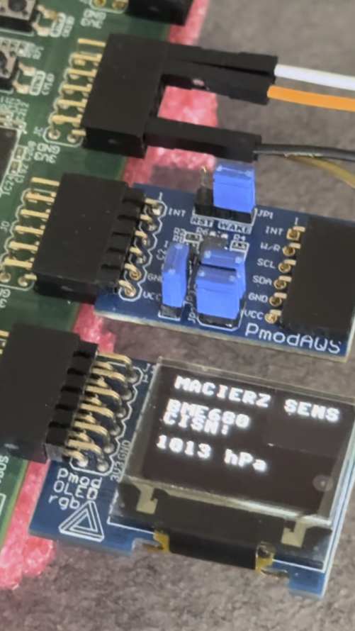
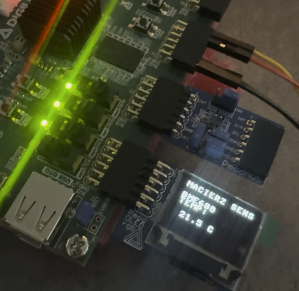
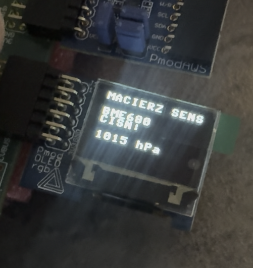
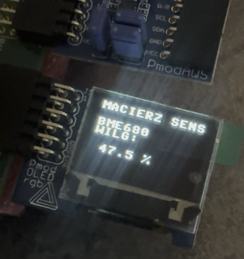

# 🌡️ Weather Matrix - Macierz Sensoryczna na FPGA

> Projekt semestralny z przedmiotu **Logika Układów Cyfrowych**  
> Akademia Wojsk Lądowych im. gen. Tadeusza Kościuszki we Wrocławiu · 2026  
> Prowadzący: mgr inż. Igor Mielczarek

---

## 📸 Demonstracja działania


*Widok ogólny układu: Zybo Z7-20 z podłączonymi sensorami BME680 i Pmod AQS oraz wyświetlaczem Pmod OLEDrgb*

---

## 📋 Spis treści

- [O projekcie](#-o-projekcie)
- [Sprzęt](#-sprzęt)
- [Architektura systemu](#-architektura-systemu)
- [Funkcjonalności](#-funkcjonalności)
- [Struktura modułów Verilog](#-struktura-modułów-verilog)
- [Obsługa użytkownika](#-obsługa-użytkownika)
- [Wyniki pomiarów](#-wyniki-pomiarów)
- [Diagnostyka](#-diagnostyka)
- [Szybki start](#-szybki-start)
- [Autorzy](#-autorzy)

---

## 🔎 O projekcie

**Weather Matrix** to autonomiczna stacja monitoringu warunków środowiskowych zrealizowana w całości jako logika sprzętowa na platformie FPGA. System zbiera dane z dwóch niezależnych sensorów podłączonych po magistrali I2C i prezentuje wyniki w czasie rzeczywistym na kolorowym wyświetlaczu OLED RGB.

W odróżnieniu od rozwiązań mikrokontrolerowych architektura sprzętowa zapewnia **deterministyczny, równoległy odczyt** z wielu sensorów bez konieczności stosowania systemu operacyjnego czasu rzeczywistego. Obie magistrale I2C (100 kHz) działają równolegle i nie blokują się wzajemnie - co stanowi kluczową zaletę platformy FPGA względem rozwiązań mikrokontrolerowych.

Projekt zaimplementowano w języku opisu sprzętu **Verilog** przy użyciu narzędzia **Vivado 2025.2**.

---

## 🛠️ Sprzęt

| Komponent | Opis | Interfejs | Port |
|-----------|------|-----------|------|
| **Zybo Z7-20** | Płytka FPGA z układem Zynq-7000, zegar 125 MHz | - | - |
| **SparkFun BME680** | Sensor pogodowy: temperatura, wilgotność, ciśnienie | I²C (adres 0x77) | Pmod JC |
| **Digilent Pmod AQS** | Sensor jakości powietrza CCS811: eCO₂, TVOC | I²C (adres 0x5B) | Pmod JD |
| **Digilent Pmod OLEDrgb** | Wyświetlacz OLED 96×64 px, 16-bit RGB565, sterownik SSD1331 | SPI (6,25 MHz) | Pmod JE |



*Schemat podłączeń - Pmod JC (BME680), Pmod JD (AQS), Pmod JE (OLED)*

---

## 🏗️ Architektura systemu

System składa się z **siedmiu modułów Verilog** połączonych hierarchicznie przez moduł nadrzędny `weathermatrix_top`:

```
weathermatrix_top
├── i2cmaster [x2]        - Monolityczny kontroler magistrali I2C (100 kHz)
│   ├── instancja #1      - obsługa BME680 (Pmod JC)
│   └── instancja #2      - obsługa Pmod AQS (Pmod JD)
├── bme680_driver         - Sterownik sensora pogodowego
├── ccs811_driver         - Sterownik sensora jakości powietrza
├── display_formatter     - Bufor tekstowy 12×8 znaków ASCII
├── font_rom              - Pamięć ROM czcionki 8×8 pikseli
└── oled_final            - Sterownik wyświetlacza OLED + nadajnik SPI
```

Dane przepływają wyłącznie w jednym kierunku: sterowniki sensorów dostarczają wartości liczbowe do formatera tekstu, który wypełnia bufor tekstowy, a sterownik wyświetlacza renderuje zawartość bufora na ekranie.

---

## ✅ Funkcjonalności

| Przełącznik | Funkcja |
|-------------|---------|
| **SW3 ↑** | Włączenie systemu - inicjalizacja OLED, start komunikacji I2C |
| **SW3 ↓** | Wyłączenie - wygaszenie wyświetlacza, zatrzymanie komunikacji |
| **SW0 ↑, SW1 ↓** | Wyświetlanie **wilgotności** z BME680 (np. `45.9 %`) |
| **SW1 ↑, SW0 ↓** | Wyświetlanie **ciśnienia** z BME680 (np. `1011 hPa`) |
| **SW0 ↑, SW1 ↑** | Wyświetlanie **eCO₂ i TVOC** z Pmod AQS |
| **SW0 ↓, SW1 ↓** | Wyświetlanie **temperatury** z BME680 (np. `22.1°C`) |

**Sygnalizacja diodami LED:**

| Dioda | Znaczenie |
|-------|-----------|
| **LD0** | System aktywny (SW3 wysoki) |
| **LD1** | Inicjalizacja OLED zakończona |
| **LD2** | BME680 odpowiada poprawnie na I2C |
| **LD3** | Pmod AQS potwierdza transakcje I2C |

Dane odświeżane są co **500 ms**, co daje efekt podglądu warunków w czasie rzeczywistym.

---

## 📦 Struktura modułów Verilog

### Kluczowe struktury logiki cyfrowej

**Maszyny stanów (FSM)**  
W projekcie zastosowano 4 maszyny stanów typu Moore. Każda FSM steruje wyłącznie sygnałami ze swojego rejestru stanu bez kombinacyjnych ścieżek na wyjściu.

- `i2cmaster` - 14 stanów, monolityczna transakcja I2C (START → adres → dane → STOP bez zwalniania linii)
- `bme680_driver` - 10 stanów, cykliczny pomiar forced mode
- `ccs811_driver` - 22 stany, sekwencja inicjalizacji + pętla pomiarowa
- `oled_final` - 28 stanów, inicjalizacja SSD1331 + renderowanie pikseli

**Multipleksery**
- MUX 4→1 wyboru trybu wyświetlania (signal `mode[1:0]` ze SW1:SW0)
- MUX 8→1 wyboru bajtu w kontrolerze I2C (licznik `byteidx`)
- MUX 2→1 wyboru koloru piksela w sterowniku OLED (bit wzorca czcionki)

**Rejestry przesuwne**
- PISO (Parallel In, Serial Out) - nadajnik SPI w sterowniku OLED
- SIPO (Serial In, Parallel Out) - odbiornik I2C
- PIPO dwustopniowy - synchronizacja sygnałów zewnętrznych (eliminacja metastabilności przełączników)

---

## 🕹️ Obsługa użytkownika

```
1. Podłącz sensory do portów Pmod zgodnie z tabelą sprzętu
2. Wgraj bitstream na płytkę Zybo Z7-20
3. Ustaw SW3 → góra (włączenie systemu)
   → LD0 zaświeci się natychmiast
   → LD1 zaświeci się po ok. 400 ms (OLED zainicjalizowany)
   → LD2 i LD3 informują o poprawności połączeń I2C
4. Ustaw SW0/SW1 aby wybrać wyświetlaną wielkość
5. Naciśnij BTN0 aby zresetować i ponownie zainicjalizować system
```

---

## 📊 Wyniki pomiarów



*Tryb temperatury: wyświetlanie wartości z BME680, np. `TEMP 22.1 C`*



*Tryb ciśnienia: wyświetlanie wartości, np. `CISN 1011 hPa`*



*Tryb wilgotności: wyświetlanie wartości, np. `WILG 45.9 %`*

Przeliczenie wartości surowych na jednostki fizyczne opiera się na wzorach empirycznych skalibrowanych na konkretnym egzemplarzu sensora. Dokładność: ±2°C, ±5% RH, ±5 hPa. Wszystkie obliczenia wykonywane są w arytmetyce całkowitej stałoprzecinkowej.

---

## 🔬 Diagnostyka

W trakcie realizacji projektu wykryto i naprawiono **fundamentalny błąd w kontrolerze I2C**: pierwotna implementacja dzieliła transakcję I2C na osobne prymitywy (START, WRITE, READ, STOP), co powodowało fałszywy warunek STOP między sekcjami - magistrala wracała do stanu spoczynkowego i sensory nie otrzymywały kompletnej sekwencji (wszystkie odczyty zwracały `0xFF`).

Rozwiązanie: kontroler przepisano jako **monolityczną maszynę stanów**, w której całość transakcji (START → adres → dane → RESTART → odczyt → STOP) wykonywana jest jako jedna nieprzerwana operacja. Po tej zmianie BME680 zaczął odpowiadać poprawnie.

Pmod AQS (układ CCS811) potwierdza transakcje na poziomie magistrali I2C, lecz zwraca `0x00` z rejestru HWID (powinno być `0x81`). Diagnoza wskazuje na **uszkodzenie sprzętowe konkretnego egzemplarza** - sterownik CCS811 jest kompletny i gotowy do pracy ze sprawnym modułem.

---

## 🚀 Szybki start

### Wymagania

- Vivado 2025.2 (lub nowszy)
- Płytka Digilent Zybo Z7-20
- Kable Pmod i sensory zgodnie z tabelą sprzętu

### Kroki

```bash
# 1. Sklonuj repozytorium
git clone https://github.com/TWOJ_USERNAME/weather-matrix-fpga.git
cd weather-matrix-fpga

# 2. Otwórz projekt w Vivado
# File → Open Project → wybierz plik .xpr z katalogu vivado/

# 3. Uruchom syntezę i implementację
# Flow → Run Implementation

# 4. Wygeneruj bitstream i zaprogramuj płytkę
# Flow → Generate Bitstream → Program Device
```

Szczegółowa dokumentacja techniczna dostępna jest w pliku [`docs/sprawozdanie.pdf`](docs/sprawozdanie.pdf).

---

## 👥 Autorzy

| Imię i Nazwisko | Nr albumu |
|-----------------|-----------|
| Wiktor Zieliński | 11854 |
| Wiktor Dams | 11864 |
| Kamil Mańka | 11137 |

**Promotor:** mgr inż. Igor Mielczarek  
**Uczelnia:** Akademia Wojsk Lądowych im. gen. Tadeusza Kościuszki we Wrocławiu  
**Rok akademicki:** 2025/2026

---

## 📄 Licencja

Projekt akademicki - Akademia Wojsk Lądowych we Wrocławiu, 2026.
